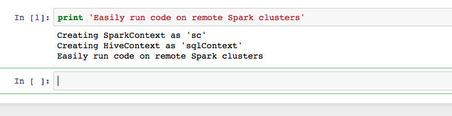
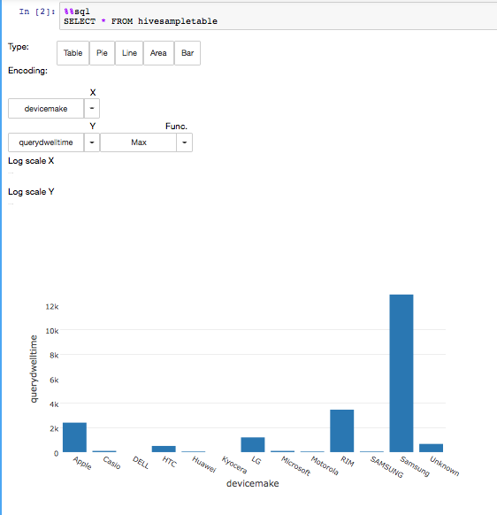
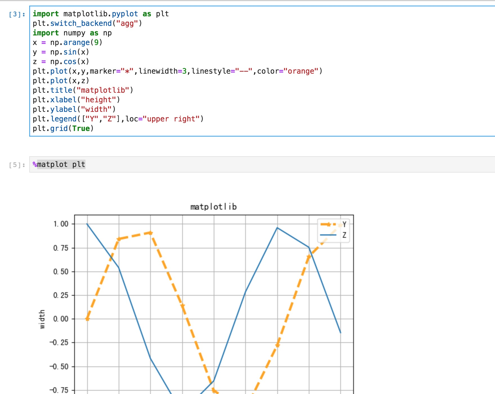
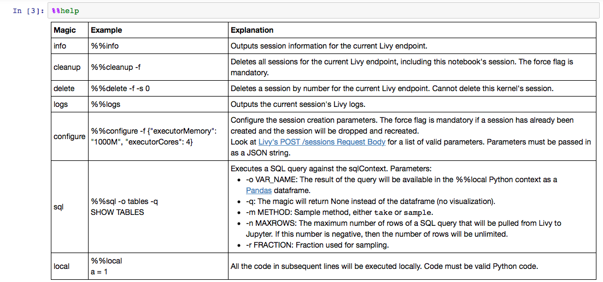

[](https://travis-ci.org/jupyter-incubator/sparkmagic) [](https://gitter.im/sparkmagic/Lobby?utm_source=badge&utm_medium=badge&utm_campaign=pr-badge&utm_content=badge)

# sparkmagic

Sparkmagic is a set of tools for interactively working with remote Spark clusters through [Livy](https://livy.incubator.apache.org/), a Spark REST server, in [Jupyter](http://jupyter.org) notebooks.
The Sparkmagic project includes a set of magics for interactively running Spark code in multiple languages, as well as some kernels that you can use to turn Jupyter into an integrated Spark environment.









## Features

* Run Spark code in multiple languages against any remote Spark cluster through Livy
* Automatic SparkContext (`sc`) and HiveContext (`sqlContext`) creation
* Easily execute SparkSQL queries with the `%%sql` magic
* Automatic visualization of SQL queries in the PySpark, Spark and SparkR kernels; use an easy visual interface to interactively construct visualizations, no code required
* Easy access to Spark application information and logs (`%%info` magic)
* Ability to capture the output of SQL queries as Pandas dataframes to interact with other Python libraries (e.g. matplotlib)
* Authenticate to Livy via Basic Access authentication or via Kerberos

## Examples

There are two ways to use sparkmagic. Head over to the [examples](examples) section for a demonstration on how to use both models of execution.

### 1. Via the IPython kernel

The sparkmagic library provides a %%spark magic that you can use to easily run code against a remote Spark cluster from a normal IPython notebook. See the [Spark Magics on IPython sample notebook](examples/Magics%20in%20IPython%20Kernel.ipynb)

### 2. Via the PySpark and Spark kernels

The sparkmagic library also provides a set of Scala and Python kernels that allow you to automatically connect to a remote Spark cluster, run code and SQL queries, manage your Livy server and Spark job configuration, and generate automatic visualizations.
See [Pyspark](examples/Pyspark%20Kernel.ipynb) and [Spark](examples/Spark%20Kernel.ipynb) sample notebooks.

## Installation

1. Install the library

        pip install sparkmagic

2. Make sure that ipywidgets is properly installed by running

        jupyter nbextension enable --py --sys-prefix widgetsnbextension 
 
3. If you're using JupyterLab, you'll need to run another command:

        jupyter labextension install @jupyter-widgets/jupyterlab-manager

4. (Optional) Install the wrapper kernels. Do `pip show sparkmagic` and it will show the path where `sparkmagic` is installed at. `cd` to that location and do:

        jupyter-kernelspec install sparkmagic/kernels/sparkkernel
        jupyter-kernelspec install sparkmagic/kernels/pysparkkernel
        jupyter-kernelspec install sparkmagic/kernels/sparkrkernel
        
5. (Optional) Modify the configuration file at ~/.sparkmagic/config.json. Look at the [example_config.json](sparkmagic/example_config.json)

6. (Optional) Enable the server extension so that clusters can be programatically changed:

        jupyter serverextension enable --py sparkmagic

## Authentication Methods

Sparkmagic supports:

* No auth
* Basic authentication
* Kerberos

Kerberos support is implemented via the [requests-kerberos](https://github.com/requests/requests-kerberos) package. Sparkmagic expects a kerberos ticket to be available in the system. Requests-kerberos will pick up the kerberos ticket from a cache file. For the ticket to be available, the user needs to have run [kinit](https://web.mit.edu/kerberos/krb5-1.12/doc/user/user_commands/kinit.html) to create the kerberos ticket.

Currently, sparkmagic does not support passing a kerberos principal/token, but we welcome pull requests.

## Docker

The included `docker-compose.yml` file will let you spin up a full
sparkmagic stack that includes a Jupyter notebook with the appropriate
extensions installed, and a Livy server backed by a local-mode Spark instance.
(This is just for testing and developing sparkmagic itself; in reality,
sparkmagic is not very useful if your Spark instance is on the same machine!)

In order to use it, make sure you have [Docker](https://docker.com) and
[Docker Compose](https://docs.docker.com/compose/) both installed, and
then simply run:

    docker-compose build
    docker-compose up

You will then be able to access the Jupyter notebook in your browser at
http://localhost:8888. Inside this notebook, you can configure a
sparkmagic endpoint at http://spark:8998. This endpoint is able to
launch both Scala and Python sessions. You can also choose to start a
wrapper kernel for Scala, Python, or R from the list of kernels.

To shut down the containers, you can interrupt `docker-compose` with
`Ctrl-C`, and optionally remove the containers with `docker-compose
down`.

If you are developing sparkmagic and want to test out your changes in
the Docker container without needing to push a version to PyPI, you can
set the `dev_mode` build arg in `docker-compose.yml` to `true`, and then
re-build the container. This will cause the container to install your
local version of autovizwidget, hdijupyterutils, and sparkmagic. Make
sure to re-run `docker-compose build` before each test run.

## Server extension API

### `/reconnectsparkmagic`:
* `POST`:
Allows to specify Spark cluster connection information to a notebook passing in the notebook path and cluster information.
Kernel will be started/restarted and connected to cluster specified.

Request Body example:
        ```
        {
                'path': 'path.ipynb',
                'username': 'username',
                'password': 'password',
                'endpoint': 'url',
                'auth': 'Kerberos',
                'kernelname': 'pysparkkernel'
        }
        ```

*Note that the auth can be either None, Basic_Access or Kerberos based on the authentication enabled in livy. The kernelname parameter is optional and defaults to the one specified on the config file or pysparkkernel if not on the config file.*
Returns `200` if successful; `400` if body is not JSON string or key is not found; `500` if error is encountered changing clusters.

Reply Body example:
        ```
        {
                'success': true,
                'error': null
        }
        ```

## Architecture

Sparkmagic uses Livy, a REST server for Spark, to remotely execute all user code. 
The library then automatically collects the output of your code as plain text or a JSON document, displaying the results to you as formatted text or as a Pandas dataframe as appropriate.


This architecture offers us some important advantages:

1. Run Spark code completely remotely; no Spark components need to be installed on the Jupyter server

2. Multi-language support; the Python, Python3, Scala and R kernels are equally feature-rich, and adding support for more languages will be easy

3. Support for multiple endpoints; you can use a single notebook to start multiple Spark jobs in different languages and against different remote clusters

4. Easy integration with any Python library for data science or visualization, like Pandas or [Plotly](https://plot.ly/python/offline)

However, there are some important limitations to note:

1. Some overhead added by sending all code and output through Livy

2. Since all code is run on a remote driver through Livy, all structured data must be serialized to JSON and parsed by the Sparkmagic library so that it can be manipulated and visualized on the client side.
In practice this means that you must use Python for client-side data manipulation in `%%local` mode.

## Contributing

We welcome contributions from everyone. 
If you've made an improvement to our code, please send us a [pull request](https://github.com/jupyter-incubator/sparkmagic/pulls).

To dev install, execute the following:

        git clone https://github.com/jupyter-incubator/sparkmagic
        pip install -e hdijupyterutils 
        pip install -e autovizwidget
        pip install -e sparkmagic
        
and optionally follow steps 3 and 4 above.

To run unit tests, run:

        nosetests hdijupyterutils autovizwidget sparkmagic

If you want to see an enhancement made but don't have time to work on it yourself, feel free to submit an [issue](https://github.com/jupyter-incubator/sparkmagic/issues) for us to deal with.
